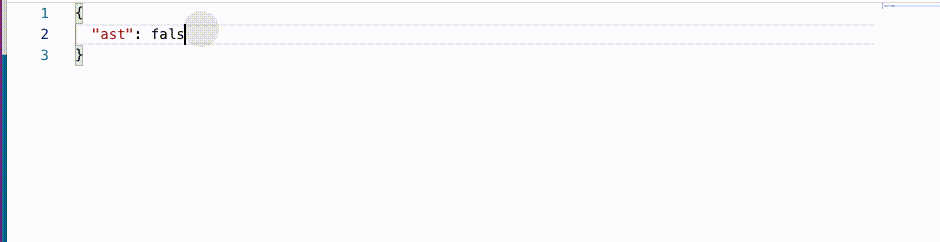

# monaco-editor-webide-demos

## 给 JSON 添加提示和检查

在大量的中后台系统中，配置一些 json 是最常见的需求，但是如果我们编写 JSON 没有任何代码提示的话，这会是一件体验很糟糕的事情，用户不知道需要写什么字段，写过的字段不知道什么意思，demo [json-validation](./json-validation/README.md) 是一个有提示有校验的例子，这里使用了 [json schema store](https://www.schemastore.org/json/) 中 babel 的配置，其实 vscode playground 给出了一个[例子](https://microsoft.github.io/monaco-editor/playground.html#extending-language-services-configure-json-defaults)，不过我个人觉得这个例子还是不够清晰，所以我单独写了一个 react 版本的，我们在实际生产环境中，这个 json schema 文件必定是下发的，不会是写死在代码里的，这样我们更新配置也只需要发布配置即可，不需要发布前端版本，我们更人性化一点，我们虽然有了提示，但是我们还需要一份文档，我们可以通过 https://github.com/adobe/jsonschema2md 将 jsonschema 转化为一份文档，这样更加高效。如果你需要去自定义 jsonSchema，参考他的官方文档即可

